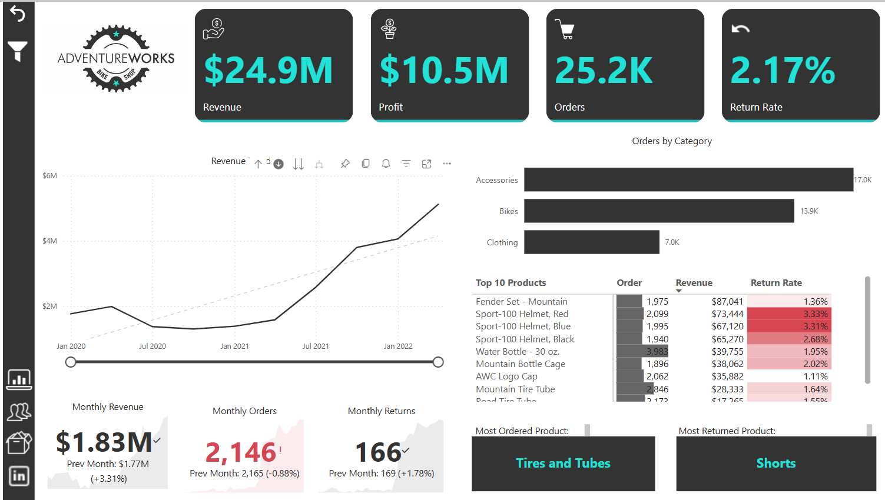
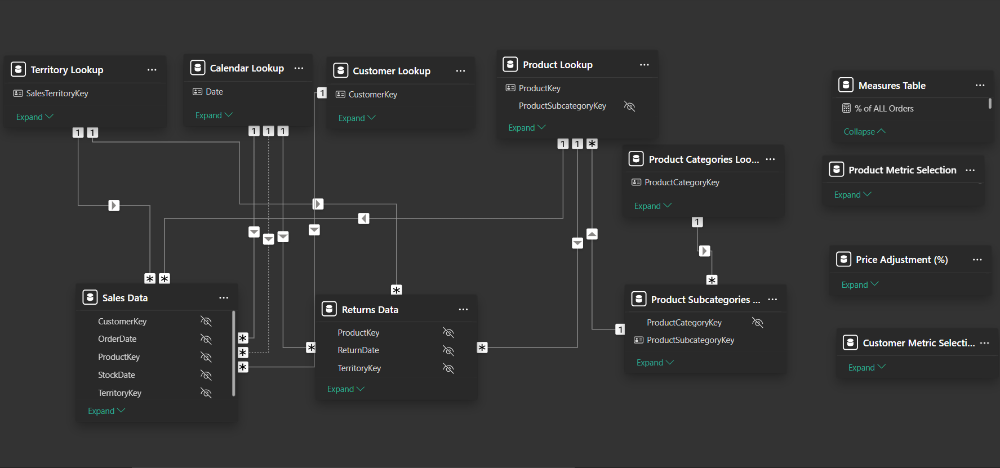
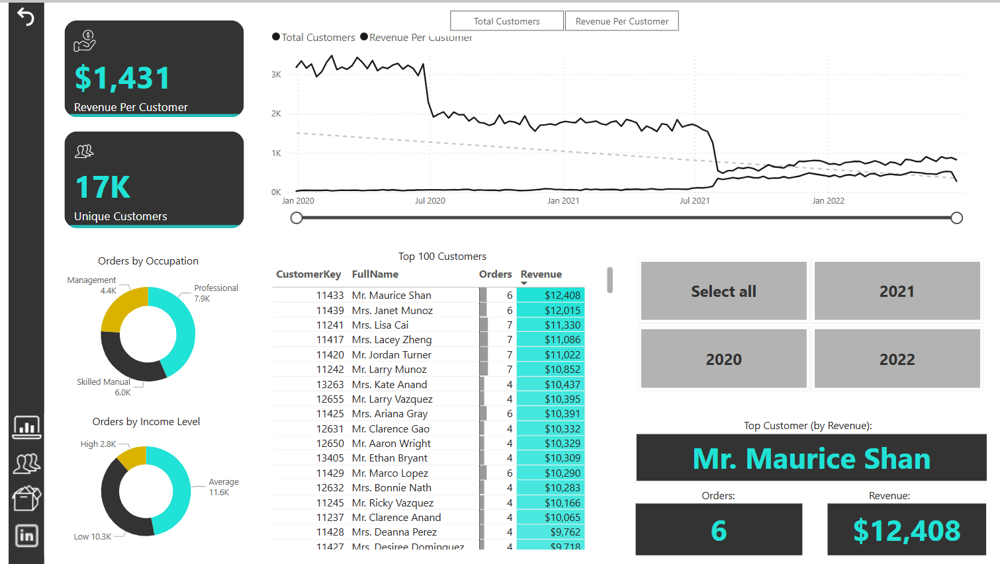
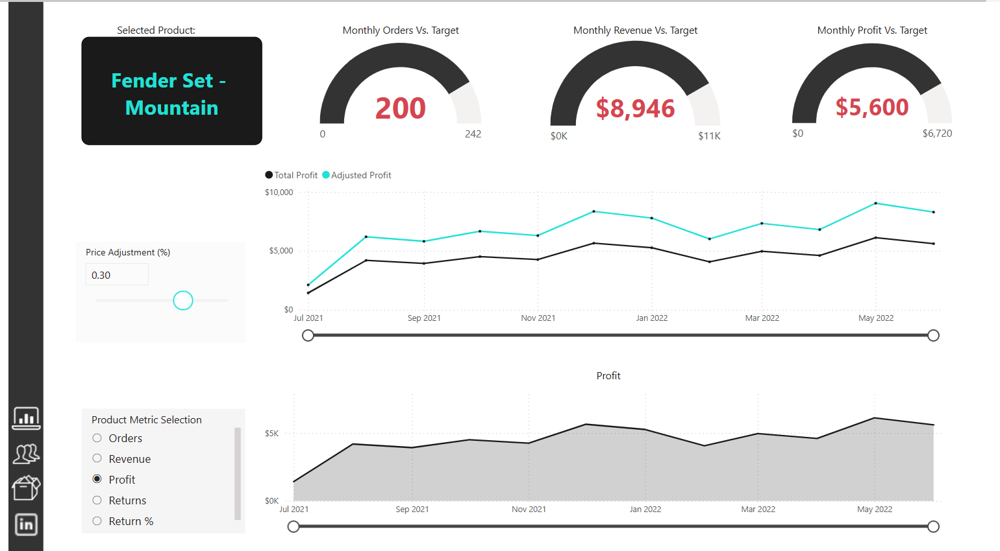
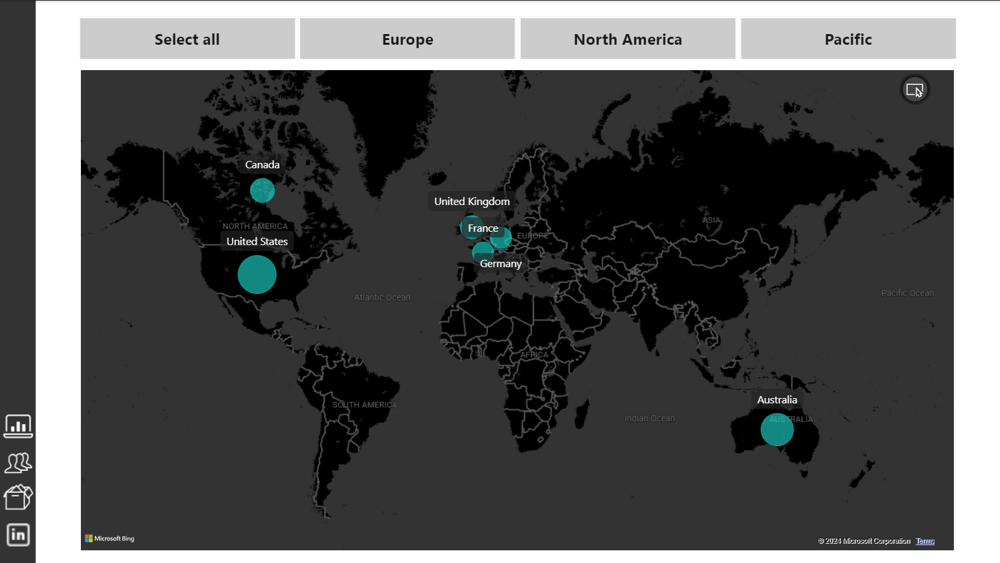

# Adventure-Works-Project
## Project Goal
The primary goal of the Adventure Works is to to track key performance indicators (KPIs), monitor and compare performance across different areas, identify key insights, and highlight high-value customers of Adventure Works from the year 2020 to 2022.

# Table Of Contents
* Installation
* About the Project
* The Data Set 
* The Data Model 
* DAX Functions 
* Insights

# Installation 
The project requires:
* `powerbi desktop` for data visualization and storytelling

# About the project
This is my first project for my Data Analysis portfolio, completed as part of the Microsoft Power BI Desktop for Business Intelligence course on Udemy by Maven Analytics. The project focuses on Adventure Works, a global manufacturing company that specializes in cycling products, including bikes, accessories, clothing, and components.
In this project, I developed a comprehensive Power BI dashboard to help the management team track essential KPIs such as revenue, profit, orders, and returns from 2020 to 2022. The dashboard also provides tools to compare regional performance, analyze product trends, and identify high-value customers.

# The Data Set 
The dataset used in this project was sourced from Maven Analytics on Udemy, provided in raw form as CSV files. I applied ETL (Extract, Transform, Load) processes, utilizing tools like Power Query to efficiently clean, transform, and load the data. This preparation ensured the dataset was ready for analysis and visualization. 
The data cleaning process included the following steps:
* Header Promotion: Ensured that the first row of data is used as the header for better clarity.
* Data Type Formatting: Adjusted data types to ensure accurate analysis and compatibility with Power BI.
* Calculated Columns: Added new calculated fields to facilitate deeper insights.
* Null Value Replacement: Addressed missing data by replacing null values appropriately.
* Column Merging and Extraction: Combined and extracted relevant columns to streamline the dataset.
* Folder Data Import: Employed the "Folder" option to append multiple related datasets efficiently.
* Data Trimming: Removed unnecessary whitespace from the dataset for cleaner data presentation.
* Standardization: Standardized column names, date formats, and currency to maintain consistency throughout the dataset.
* Data Profiling: Conducted data profiling to ensure quality assurance and identify any data anomalies on the entire dataset.
* Removal of Unwanted Columns and Duplicates: Cleared out irrelevant columns and eliminated duplicate entries to refine the dataset.

# The Data Model

I established a downward flow data model to ensure a seamless connection between the fact tables and dimension tables. For this model, I employed a Star Schema for all tables, while a Snowflake Schema was utilized for the product Categories Lookup, Product SubCategories Lookup and Product Lookup. The relationships between the tables were established based on primary and foreign keys, adopting a one-to-many cardinality with a single cross-filter direction. Additionally,  I designated the primary key in each table as the key column and hid all foreign keys to streamline the model and enhance clarity.

# Insights
After analyzing the Adventure Works dataset and conducting data cleaning, here are the key insights:
## Executive
From 2020 to 2022, Adventure Works achieved a total revenue of $24.9 million and a profit of $10.5 million from 25,200 orders, with a return rate of 2.17%. Within the four product categories, Bikes led in sales, with 13,929 units sold, generating $23.6 million in revenue and a profit of $9.7 million. In contrast, Accessories contributed $906,673 in revenue and a profit of $569,760 from a total of 17,000 units sold.

## Monthly Performance by Category:
The Bikes category achieved $1.7 million in monthly revenue, up to 3.75% from the previous month, and experienced a lower return rate, reflecting strong monthly performance. Accessories, however, fell 7.19% below its monthly revenue KPI and 5.51% below last month’s profit. The Clothing category saw a revenue increase of 11.45% and a 10.85% rise in orders over the previous month, bringing in $40,000 in the current month.

## Revenue Trend Analysis:
Over these years, Adventure Works experienced fluctuating revenue trends. Revenue significantly increased from 2020 to 2021, reaching over $9 million, but declined slightly in 2022. This suggests a need to investigate contributing factors, such as shifts in customer spending, competitive pressures, or economic factors, to find strategies for boosting growth. The decline in revenue momentum after 2021 indicates the importance of re-accelerating growth through targeted strategies.

## Impact of COVID-19 on 2020 Revenue:
During 2020, Adventure Works experienced a significant revenue drop, with Q3 revenue falling from $1.9 million in Q2 to $1.3 million, and then to $1.2 million in Q4. This decline was likely driven by the impacts of COVID-19 on customer spending and supply chains. Interestingly, despite this drop, Q3 saw a 15.92% increase in orders over Q2, highlighting strong demand but reduced profitability during the pandemic.
However, beginning in Q1 2021, the revenue trend started to recover, showing a positive upward trajectory as market conditions stabilized and demand picked up.

## 2021 Bikes Performance Highlight:
In 2021, the Bikes category sold 931 units, driving $1.6 million in revenue and generating $670,300 in profit for the year, demonstrating its critical role in the company's overall profitability.

## Customer Detail

Adventure Works has built a customer base of 17,000, with an average revenue per customer of $1,431. The top customer segments by occupation include professionals, skilled manual workers, and management, reflecting strong engagement among these groups. Customers with an average income level contributed the most orders, totaling 11,600 units over the years.

A review of revenue per customer over time reveals a downward trend. In February 2020, Adventure Works achieved its highest average revenue per customer, at $3,476 across 32 customers. However, this number dropped significantly by July 2020 and continued on a declining trend, albeit at a slower rate. A second major drop occurred in August 2021, with the lowest recorded revenue per customer at $544 among 347 customers.

Among individual customers, Mr. Maurice Shan emerged as the top revenue contributor, generating $12,285 from six bike orders.

However, the average revenue per customer continued to decline, indicating that while the customer base is expanding, individual spending has decreased. This trend suggests a potential opportunity to focus on strategies aimed at increasing individual customer spending to drive higher revenue per customer.

## Product Analysis

This report page serves as a drillthrough on  product names, offering deeper insights into individual product performance. The gauges indicate that Adventure Works fell short of its monthly KPIs for the selected product, "Fender Set Mountain." A total of 200 orders were recorded, below the target of 242 orders. The product generated $8,946 in monthly revenue, missing the target of $11,000, while profit reached $5,600, also falling short of the $6,720 target.

A price adjustment parameter allows for testing how a 10% increase or decrease in the retail price would impact profit, providing a tool for strategic pricing decisions. Additionally, the product metric selection feature dynamically displays trends for the chosen metric over the years, helping to track long-term performance.

## Geographic Orders Overview

The map visualizes orders by continent, highlighting key regional insights. Over the years, the highest volume of orders 8,700 units was made in the USA, followed by Australia with 6060 units. In Europe, the United Kingdom leads with 2,771 orders, marking it as the region’s top market.
